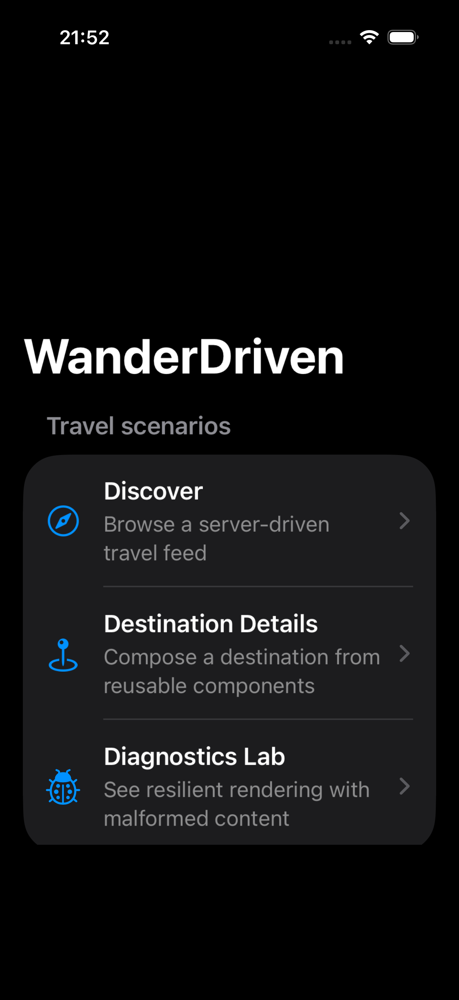
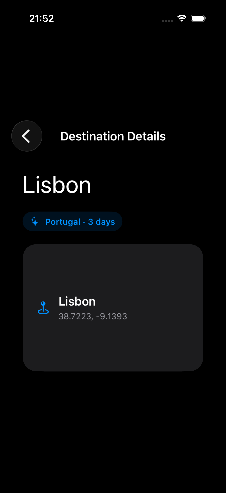
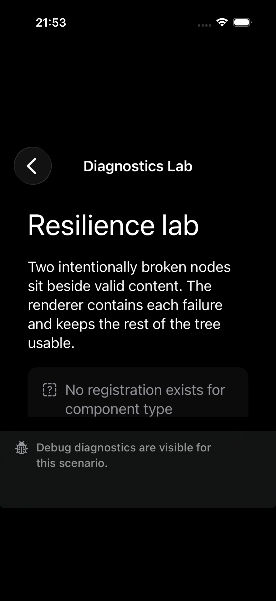
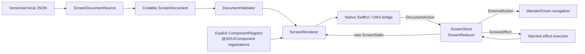

# WanderDriven

WanderDriven is a small, production-minded Server-Driven UI (SDUI) portfolio project for iOS. It renders travel experiences from versioned JSON documents while keeping the document model immutable, runtime state normalized, and application-owned navigation outside the reusable framework.

The project is deliberately compact: a reviewer can follow the entire path from JSON to native SwiftUI, inspect the macro-generated registration adapter, and run the failure-containment and interaction tests without a backend or external account.

## What this demonstrates

- Swift 6 and iOS 26 with SwiftUI, Observation (`@Observable`), structured concurrency, and strict `Sendable` boundaries.
- A reusable `ServerDrivenKit` Swift package with decoding, validation, registry resolution, rendering, diagnostics, actions, effects, and a reducer-driven store.
- A SwiftSyntax `@SDUIComponent` attached macro that removes repetitive type-erasure and property-decoding glue while keeping registration explicit.
- Native SwiftUI components with Dynamic Type, dark-mode-friendly materials, semantic typography, 44-point interaction targets, and VoiceOver labels.
- A focused UIKit bridge: a map preview implemented as a `UIViewRepresentable` and updated through the normal make/update lifecycle.
- Deterministic Swift Testing, macro tests, application tests, and XCUITest journeys.
- Resilient rendering: an unknown component or malformed properties become a local diagnostic view; valid siblings remain usable.

## The demo

Run the app and choose one of three local scenarios:

| Scenario | Demonstrates |
| --- | --- |
| **Discover** | A scrollable travel feed, typed destination cards, explicit navigation, and favorite state. |
| **Destination Details** | A second document, a UIKit map preview, and a document-defined alert action. |
| **Diagnostics Lab** | An unknown component and malformed properties rendered beside valid content. |

All content is bundled JSON. There is no backend, network request, authentication, booking flow, or persistent database in version 1.

### Screens from the bundled scenarios

| Discover | Destination Details | Diagnostics Lab |
| --- | --- | --- |
|  |  |  |

## Architecture at a glance



`ServerDrivenKit` owns the reusable runtime. `WanderDriven` owns travel-specific components, bundled documents, route mapping, and the host navigation stack. See [the architecture note](docs/architecture.md) for invariants and lifecycle details.

### Package boundaries

| Layer | Responsibility |
| --- | --- |
| `ScreenDocument` | Immutable, `Codable`, `Equatable`, `Sendable` tree of stable component IDs, properties, children, and declared actions. |
| `DocumentValidator` | Schema version, duplicate ID, container, and required action-field checks at the document boundary. |
| `ComponentRegistry` | Explicit mapping from a wire component type to a strongly typed factory; type erasure is limited to this heterogeneous edge. |
| `ScreenRenderer` | Recursive rendering of layout primitives and registered content, with local diagnostic fallbacks. |
| `ScreenReducer` | Synchronous and deterministic state transitions for favorites, alerts, effects, and external actions. |
| `ScreenStore` | `@MainActor` observable owner that dispatches actions, runs/cancels effects, and publishes a small revision token for cached screen stores. |
| `WanderDriven` | App-owned routes, local source, travel components, UIKit integration, and scenario presentation. |

## Schema example

The wire format is intentionally small and independently designed. Layout primitives (`scroll`, `vertical`, and `horizontal`) are interpreted by the package; content types are resolved through the registry.

```json
{
  "schemaVersion": 1,
  "root": {
    "id": "discover-screen",
    "type": "scroll",
    "properties": { "spacing": 18 },
    "children": [
      {
        "id": "lisbon-card",
        "type": "destination.card",
        "properties": {
          "destinationID": "lisbon",
          "name": "Lisbon",
          "country": "Portugal",
          "summary": "Tram-lined hills, tiled courtyards and Atlantic light.",
          "imageSystemName": "sun.horizon"
        },
        "actions": [
          {
            "type": "navigate",
            "payload": { "destinationID": "lisbon" }
          },
          {
            "type": "toggleFavorite",
            "payload": { "destinationID": "lisbon" }
          }
        ]
      }
    ]
  }
}
```

The decoder retains property values as a small recursive `JSONValue`. The selected registration then decodes its own `Properties` type, so component code never depends on `[String: Any]`.

## Macro-backed components

The attached macro generates only the repetitive adapter surface. It does not discover components globally or hide the registration list:

```swift
@SDUIComponent("destination.card")
struct DestinationCard: ComponentDefinition {
    struct Properties: Decodable, Sendable {
        let destinationID: String
        let name: String
        let country: String
        let summary: String
        let imageSystemName: String
    }

    @MainActor
    static func makeView(
        properties: Properties,
        context: ComponentContext
    ) -> some View {
        // The context exposes only this component's state and send closure.
        DestinationCardView(
            componentID: context.componentID,
            properties: properties,
            isFavorite: context.state.isFavorite,
            onFavorite: {
                if let action = context.actions.first(where: { $0.type == "toggleFavorite" }) {
                    context.send(action)
                }
            },
            onSelect: {
                if let action = context.actions.first(where: { $0.type == "navigate" }) {
                    context.send(action)
                }
            }
        )
    }
}
```

Application composition remains readable and deterministic:

```swift
let registry = try ComponentRegistry {
    TextComponent.registration
    ButtonComponent.registration
    DestinationCard.registration
    Badge.registration
    UIKitMapPreview.registration
}
```

## State and actions

The decoded tree is never mutated to represent interaction. `ScreenState` stores normalized component state keyed by `ComponentID`; `ScreenReducer` changes that state and returns descriptions of asynchronous or host-owned work.

```text
View tap
  -> ComponentContext.send(DocumentAction)
  -> ScreenStore.send(ScreenAction.document(...))
  -> ScreenReducer.reduce(&state, action)
  -> [ScreenEffect]
  -> updated ScreenState / external navigation / effect result
```

This is Redux-like unidirectional data flow without bringing a third-party Redux dependency into the portfolio project. The reducer is easy to test synchronously, while the store owns cancellation and `@MainActor` UI observation.

## Failure containment

Failures stop at the narrowest safe boundary:

| Failure | Result |
| --- | --- |
| Invalid JSON or unsupported schema | The host shows a full-screen load error with a retry action. |
| Duplicate IDs or invalid container children | Validation fails before rendering. |
| Unknown component type | `UnsupportedComponentView` for that node; siblings continue. |
| Known component with malformed properties | `InvalidComponentView` for that node; siblings continue. |
| Unknown document action | No-op in the reducer; the document remains safe to render. |
| Release diagnostics | A neutral message avoids exposing implementation details. |

The **Diagnostics Lab** fixture exercises the two local rendering fallbacks and keeps a valid badge visible next to them.

## Run locally

Prerequisites:

- macOS with Xcode 26.2 or a later Xcode release that supports the iOS 26 SDK.
- Swift 6 toolchain.
- [XcodeGen](https://github.com/yonaskolb/XcodeGen), SwiftFormat, and SwiftLint for the optional verification script.

Generate the project and open it:

```bash
xcodegen generate
open WanderDriven.xcodeproj
```

Run the package and application unit tests:

```bash
swift test --package-path Packages/ServerDriven
xcodebuild -project WanderDriven.xcodeproj \
  -scheme WanderDriven \
  -destination 'platform=iOS Simulator,name=iPhone 17 Pro' \
  test
```

Run the fast checks (formatting, linting, package tests, project generation, and a clean build of app/test bundles):

```bash
bash scripts/verify.sh
```

Set `RUN_UI_TESTS=1` to add the three XCUITest journeys, as the application job in CI does. `UI_TEST_DESTINATION` can override the simulator when its name differs:

```bash
RUN_UI_TESTS=1 \
UI_TEST_DESTINATION='platform=iOS Simulator,name=iPhone 17 Pro' \
bash scripts/verify.sh
```

Run the UI journeys on a booted iOS 26 simulator:

```bash
xcodebuild -project WanderDriven.xcodeproj \
  -scheme WanderDriven \
  -destination 'platform=iOS Simulator,name=iPhone 17 Pro' \
  -only-testing:WanderDrivenUITests \
  test
```

The UI tests use `-uiTestScenario` launch arguments to select deterministic documents without changing normal production startup.

## Design decisions

- [Immutable document, normalized runtime state](docs/decisions/0001-immutable-document-and-runtime-state.md) explains why content and interaction state are separate values.
- [Explicit macro-backed registry](docs/decisions/0002-explicit-macro-backed-registry.md) explains why the macro removes boilerplate but does not perform implicit module-wide discovery.
- [Architecture and lifecycle](docs/architecture.md) describes validation, rendering, effects, actor isolation, and host boundaries.

## Non-goals and next steps

Version 1 intentionally excludes remote loading, persistence, authentication, booking, analytics, A/B testing, schema editing, and pre-iOS-26 compatibility. A production follow-up could add an authenticated `ScreenDocumentSource`, a cache, telemetry around diagnostic codes, and a migration strategy for newer schema versions without changing the renderer or reducer contracts.

## Portfolio context

This repository is an independently designed demonstration for freelance iOS work. It uses no employer source code, private documentation, internal identifiers, or proprietary behavior. The travel domain is only a concrete, reviewable setting for showing architecture and implementation quality.

## License

MIT. See [LICENSE](LICENSE).
